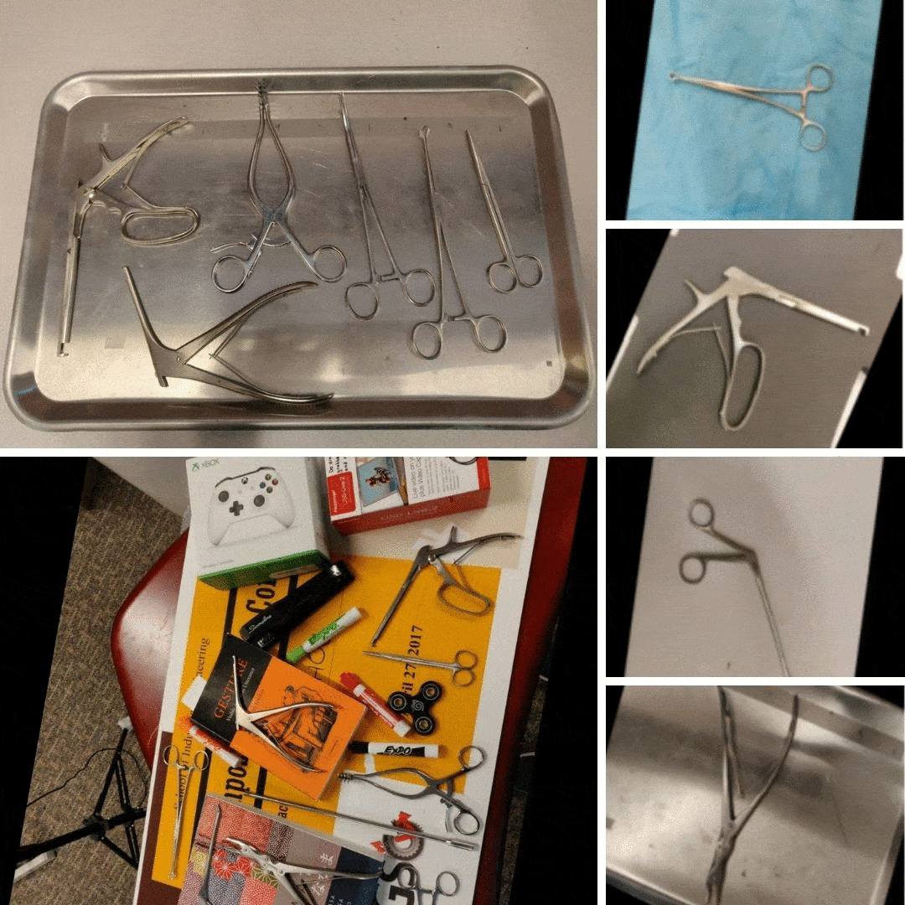
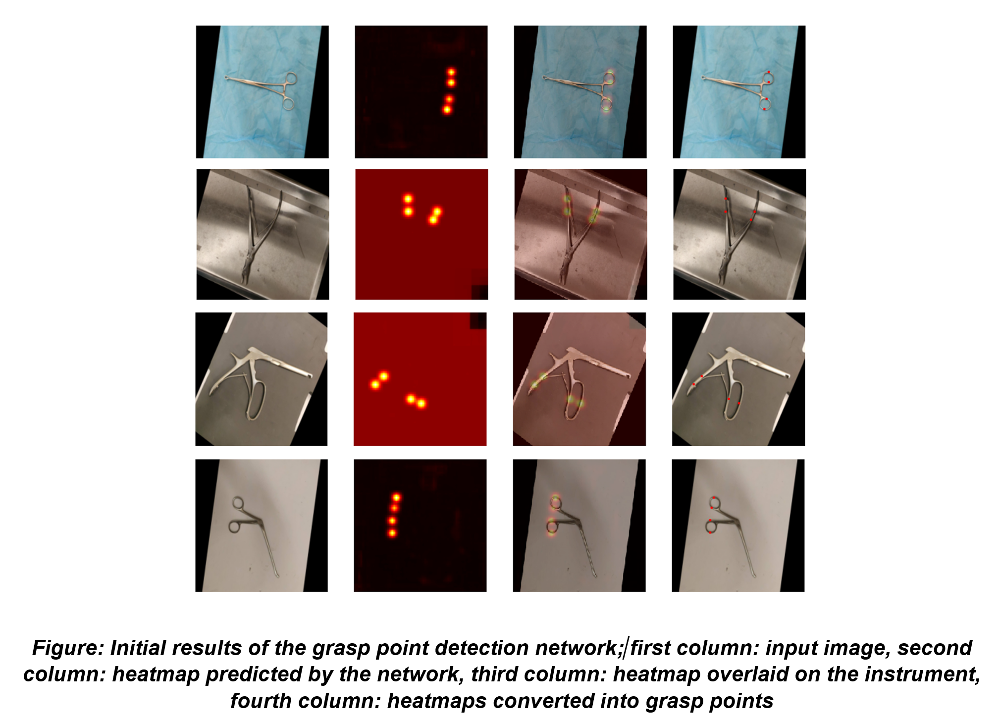
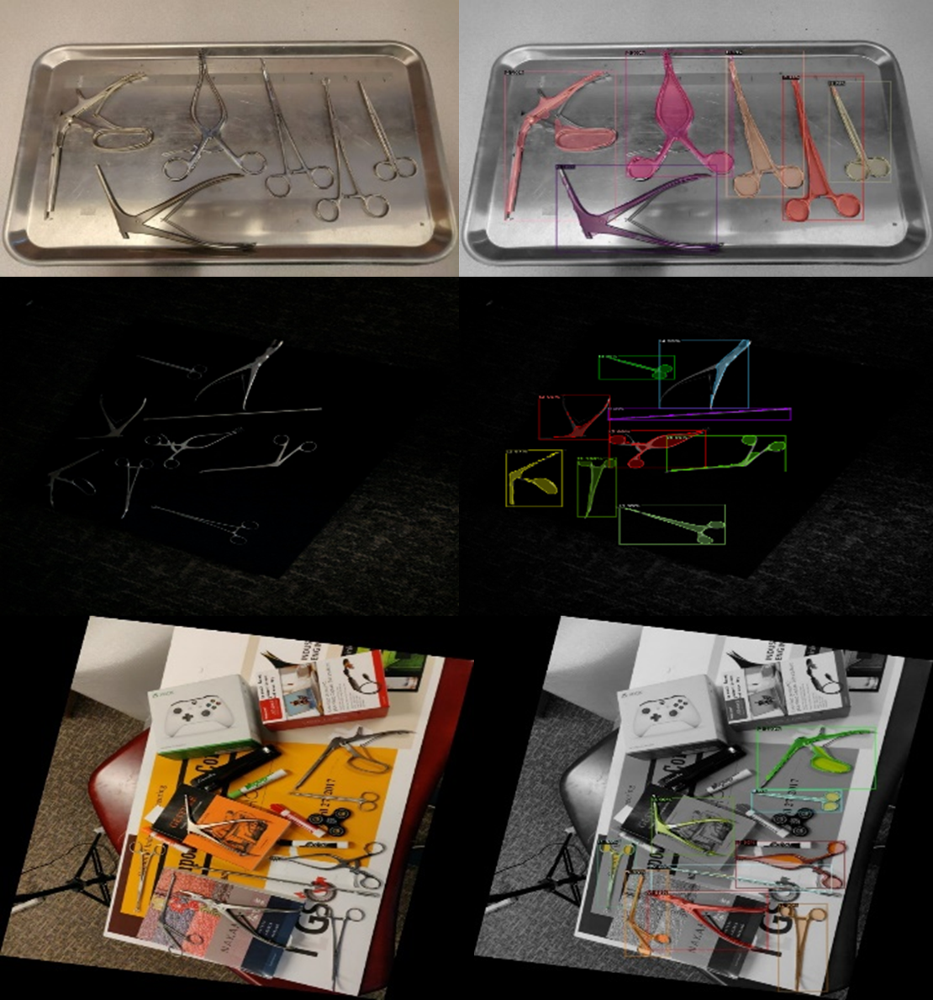

# Detection and Segmentation of Surgical Instruments and their Grasp Points
## Description
Detection and Segmentation of surgical instruments in diverse lighting conditions, and backgrounds. The approximate grasp points (where to place the gripper) are estimated using a fully convolutional network. 

## Grasp Point Detection
- Download and arrange our data in the `data` folder from here: [Google drive]()
- Download our pre-trained checkpoints from here: [Google drive]()
- For Training, refer to the `train.ipynb` notebook.
- For Inference, refer to the `inference.ipynb` notebook.

## Instrument Detection and Segmentation
- Refer to the `./ins_det_seg` directory.

The detection and segmentation network is based on Mask R-CNN from [detectron2](https://github.com/facebookresearch/detectron2). 
