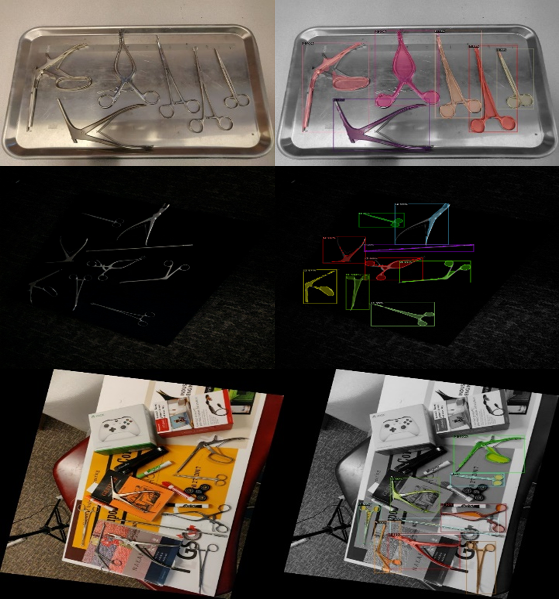

# Surgical Instrument Detection and Segmentation
## Description
Detection and Segmentation of surgical instruments in diverse lighting conditions, and backgrounds.  

## Instrument Detection and Segmentation
- Download and arrange our data and annotations in the `data` folder from here: [Google drive](https://drive.google.com/file/d/1pW37bOBnpe71-RH9CCS6qMIewMazaNIg/view?usp=sharing)
- Download our pre-trained checkpoints from here: [Google drive](https://drive.google.com/file/d/1a8VkFZJtqMCtSGq8SChNx-zMpqBwKdPc/view?usp=sharing)
- For Training. Inference, and Testing, refer to the `ins_seg.ipynb` notebook.
- For Inference, you dont't need to download the dataset.

